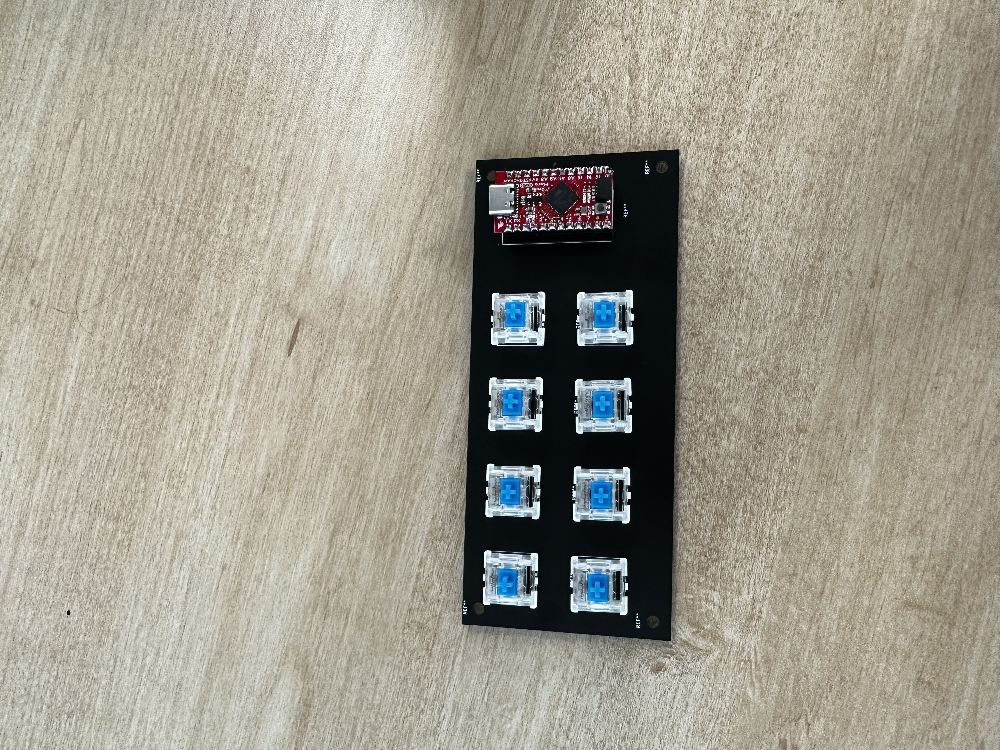

# Sam's Macropad

## Overview

This project is my first custom-designed PCB, a DIY Keyboard Macropad. A macropad is a peripheral that resembles a regular keyboard, but it can replicate keyboard functions by using custom macros assigned to each key of the macropad.


  
## Version 1

I had a few design parameters in mind when designing the first version. Firstly, I wanted the board to have USB-C connectivity. Secondly, I wanted it to have hot-swappable key switches(I created a second board that you can solder key switches directly into, and that is not hot-swappable).

**Components** 

* Kalih Hot-Swappable PCB Socket
* Any MX  Style Mechanical switch
* Sparkfun Qwiic Pro Micro - USB-C (Any Arduino Pro Micro will work. This is just the one I used) - [SparkFun Qwiic Pro Micro - USB-C (ATmega32U4) - DEV-15795 - SparkFun Electronics](https://www.sparkfun.com/products/15795)
* 2.54mm male and female headers

**Hardware**

After ordering the PCB, it is only a matter of soldering on the Kalih sockets on the back and soldering the Pro Micro to the board. On my project, I actually used a separate set of female headers in order to be able to pull off the Pro Micro if anything went wrong without having to resolder the whole thing.

**Software**

Almost all of my issues were software related. The main issue was me accidentally bricking the Pro Micro. This was because I did not realize that you had to add the Sparkfun boards to the Arduino Board Manager Library and set the voltage and frequency o the “Processor” tab in the Tools dropdown menu. I edited the code from a project on Instructables [Macropad for Keyboard Shortcuts : 8 Steps (with Pictures) - Instructables](https://www.instructables.com/Macropad-for-Keyboard-Shortcuts/), which uses the “OneButton” Arduino library. Finally, after messing with their code and creating my own, I ended up with the V1 of my Macropad.

**Code**


``` 
#include <Keyboard.h>   // https://github.com/arduino-libraries/Keyboard/blob/master/src/Keyboard.h
#include <OneButton.h>    // Library for button input functions, https://github.com/mathertel/OneButton

//setup buttons with OneButton
OneButton button1(
  3,          // Pin Number  (function: MUTE)
  true,       // Input is active LOW
  true        // Enable internal pull-up resistor
);
OneButton button2(
  2,         // Pin Number  (function: HAND)
  true,       // Input is active LOW
  true        // Enable internal pull-up resistor
);
OneButton button3(
  0,          // Pin Number  (function: VIDEO)
  true,       // Input is active LOW
  true        // Enable internal pull-up resistor
);
OneButton button4(
  1,          // Pin Number  (function: VIDEO)
  true,       // Input is active LOW
  true        // Enable internal pull-up resistor
);
OneButton button5(
  7,          // Pin Number  (function: VIDEO)
  true,       // Input is active LOW
  true        // Enable internal pull-up resistor
);
OneButton button6(
  6,          // Pin Number  (function: VIDEO)
  true,       // Input is active LOW
  true        // Enable internal pull-up resistor
);
OneButton button7(
  5,          // Pin Number  (function: VIDEO)
  true,       // Input is active LOW
  true        // Enable internal pull-up resistor
);
OneButton button8(
  4,          // Pin Number  (function: VIDEO)
  true,       // Input is active LOW
  true        // Enable internal pull-up resistor
);


void setup() {
  button1.attachClick(button1click); // Set up button 1 for mute toggle function
  button2.attachClick(button2click); // Set up button 2 for hand toggle function
  button3.attachClick(button3click); // Set up button 3 for video toggle function
  button4.attachClick(button4click); // Set up button 1 for mute toggle function
  button5.attachClick(button5click); // Set up button 2 for hand toggle function
  button6.attachClick(button6click); // Set up button 3 for video toggle function
  button7.attachClick(button7click); // Set up button 1 for mute toggle function
  button8.attachClick(button8click); // Set up button 2 for hand toggle function
  

  Keyboard.begin(); //Init keyboard emulation
  Serial.begin(9600); // begin serial comms for debugging
}//end setup


// Check status of buttons in a continuous loop
void loop() {
  button1.tick();
  button2.tick();
  button3.tick();
  button4.tick();
  button5.tick();
  button6.tick();
  button7.tick();
  button8.tick();

} //end loop

/**
   Since Zoom version 5.8, short delays are needed so as not to change the visibility of the
   status bar at the bottom of the meeting, which is triggered by the ALT key
*/
void button1click() {
  Serial.println("Pressing alt+a for Mute/Unmute");
  Keyboard.press('a');
  Keyboard.release('a');
}


void button2click() {
  Serial.println("Pressing alt+a for Mute/Unmute");
  Keyboard.press('b');
  Keyboard.release('b');
}

void button3click() {
  Serial.println("Pressing alt+a for Mute/Unmute");
  Keyboard.press('c');
  Keyboard.release('c');
}
void button4click() {
  Serial.println("Pressing alt+a for Mute/Unmute");
  Keyboard.press('d');
  Keyboard.release('d');
}
void button5click() {
  Serial.println("Pressing alt+a for Mute/Unmute");
  Keyboard.press('e');
  Keyboard.release('e');
}


void button6click() {
  Serial.println("Pressing alt+a for Mute/Unmute");
  Keyboard.press('f');
  Keyboard.release('f');
}

void button7click() {
  Serial.println("Pressing alt+a for Mute/Unmute");
  Keyboard.press('g');
  Keyboard.release('g');
}
void button8click() {
  Serial.println("Pressing alt+a for Mute/Unmute");
  Keyboard.press('h');
  Keyboard.release('h');
}


```

